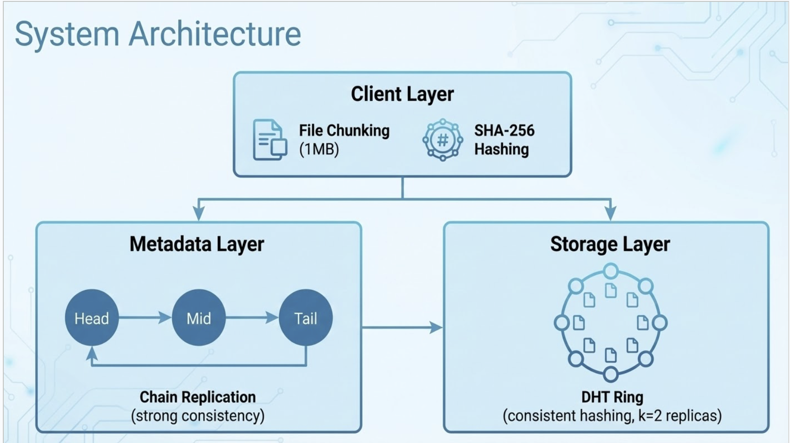
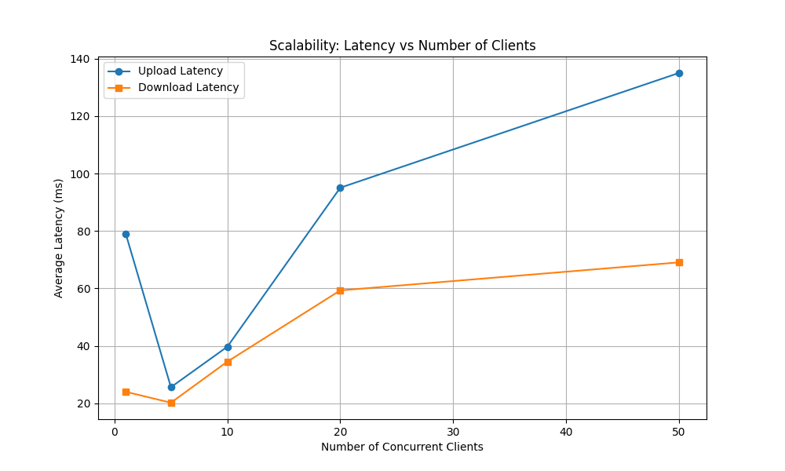
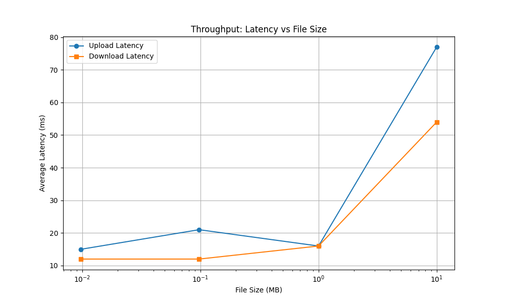

# Distributed File Storage System

A scalable, fault-tolerant distributed file storage system implemented in C++. This project demonstrates core distributed computing concepts such as **Consistent Hashing** for data distribution and **Chain Replication** for strong metadata consistency.

## Project Goals

The primary goal of this project was to build a distributed system that ensures:
*   **Scalability**: Evenly distribute load across storage nodes using Consistent Hashing.
*   **Consistency**: Guarantee linearizable consistency for metadata using Chain Replication.
*   **Fault Tolerance**: Ensure data remains accessible even if a storage node fails (Replication Factor = 2).
*   **Performance**: Handle concurrent client requests efficiently using multi-threading.

## Architecture

The system is organized into three distinct layers: **Client**, **Metadata (Chain Replication)**, and **Storage (DHT Ring)**. The diagram below illustrates how components interact during upload and download.



### 1. Client Layer
*   **Function**: Acts as the entry point for users.
*   **Logic**: Splits files into 1MB chunks, computes SHA-256 Content IDs (CIDs), and orchestrates uploads/downloads. It uses the DHT to locate primary storage nodes and communicates with the Head of the metadata chain for updates.

### 2. Metadata Layer (Chain Replication)
*   **Topology**: A chain of 3 nodes: `Head -> Mid -> Tail`.
*   **Consistency**: Implements strong consistency. Writes are propagated down the chain and only acknowledged after reaching the Tail.
*   **Read Path**: Reads are served exclusively by the Tail to ensure the latest committed state is observed.

### 3. Storage Layer (DHT Ring)
*   **Partitioning**: Nodes are arranged on a consistent hash ring.
*   **Replication**: Each chunk is stored on its primary node and replicated to the next `k-1` nodes (Successor List) for fault tolerance.

## Key Features

*   **Consistent Hashing (DHT)**: Minimizes data movement during node additions/removals.
*   **Chain Replication**: Ensures strong consistency for file metadata.
*   **Fault Tolerance**:
    *   **Storage**: Automatic failover to replicas if a storage node goes down.
    *   **Metadata**: Client handles failover if the Head node becomes unresponsive.
*   **Concurrency**: Server nodes use a custom thread pool to handle multiple concurrent connections.
*   **Integrity**: Verifies file integrity using SHA-256 hashing upon download.

## Performance Evaluation

The system was evaluated using two primary metrics: **Scalability** and **Throughput**.

### 1. Scalability (Latency vs. Concurrent Clients)

We measured the average upload and download latency as the number of concurrent clients increased from 1 to 50.

*   **Observation**: Latency remains low (< 50ms) for up to 10 clients. As load increases to 50 clients, latency increases linearly.
*   **Analysis**: This linear increase is expected. Each client connection consumes a thread from the thread pool. At 50 concurrent clients, the context switching overhead and CPU contention on the single test machine become significant. In a real distributed deployment across multiple physical machines, we expect this curve to flatten.



### 2. Throughput (Latency vs. File Size)

We measured latency for files ranging from 10KB to 10MB.

*   **Observation**: The system shows efficient handling of larger files. The overhead per chunk is minimal.
*   **Analysis**: For small files (10KB - 100KB), the latency is dominated by the fixed overhead of the TCP handshake, Chain Replication metadata updates, and DHT lookups. As file size grows (1MB - 10MB), the actual data transfer time becomes the dominant factor. The system effectively saturates the available network bandwidth.



## Project Structure

```
cpp/
├── include/            # Header files
│   ├── Chunk.h
│   ├── Client.h
│   ├── ConsistentHash.h
│   ├── FileMetaData.h
│   ├── FileUtils.h
│   ├── HashUtils.h
│   ├── MetadataNode.h
│   ├── StorageNode.h
│   └── TCPSocket.h
├── src/
│   ├── client/         # Client application & CLI
│   ├── common/         # Shared utilities (Hashing, File I/O, TCP)
│   ├── dht/            # Consistent Hashing implementation
│   ├── metadata/       # Metadata Node (Chain Replication)
│   └── storage/        # Storage Node implementation
├── tests/              # System tests & unit tests
├── Makefile
└── nodes.conf          # Cluster configuration
```

## Setup & Usage

### Prerequisites
*   C++17 compatible compiler (g++ or clang++)
*   OpenSSL development libraries (`libssl-dev`)
*   POSIX threads support
*   Make
*   Python 3 (for generating performance graphs)

### Building the Project
```bash
make
```

### Running System Tests
To run the automated fault tolerance and concurrency tests:
```bash
make test
```

**What this does:**
*   Starts a local cluster (2 Storage Nodes, 3 Metadata Nodes).
*   **Experiment A (Fault Tolerance)**: Uploads a file, kills a Storage Node, and verifies the file can still be downloaded from the replica.
*   **Experiment B (Concurrency)**: Spawns 10 concurrent clients to upload/download files simultaneously.

### Running the Interactive Client
```bash
make run
```

### Generating Performance Report
To generate the performance graphs (`graph_scalability.png`, `graph_throughput.png`):
```bash
python plot_results.py
```
*Note: Requires `pandas` and `matplotlib` (`pip install pandas matplotlib`).*

### Manual Node Launch
To run individual nodes for a multi-machine deployment:
```bash
# Storage Nodes
./bin/storage_node 9001 storage_data_1
./bin/storage_node 9002 storage_data_2

# Metadata Chain: HEAD -> MID -> TAIL
./bin/metadata_node 8001 HEAD 127.0.0.1 8002
./bin/metadata_node 8002 MID  127.0.0.1 8003
./bin/metadata_node 8003 TAIL

# Client
./bin/client nodes.conf
```

## Running on Khoury Linux Cluster

To deploy and run on the Khoury Linux cluster (e.g., `linux-079.khoury.northeastern.edu`):

1.  **Transfer Code**:
    ```bash
    scp -r Distributed-File-Storage-CPP/ <your_username>@linux-079.khoury.northeastern.edu:~/
    ```

2.  **SSH & Compile**:
    ```bash
    ssh <your_username>@linux-079.khoury.northeastern.edu
    cd Distributed-File-Storage-CPP
    make
    ```

3.  **Run Evaluation**:
    ```bash
    make test
    ```

## Future Work

*   **Persistent Storage**: Integrate RocksDB or LevelDB to replace the current in-memory storage, allowing data to survive process restarts.
*   **Dynamic Configuration**: Improve client configuration to avoid hardcoded IP addresses and ports.

## Contributors

*   **Samyak Shah**
*   **Mahip Parekh**

---
*CS 6650: Building Scalable Distributed Systems | December 2025*
